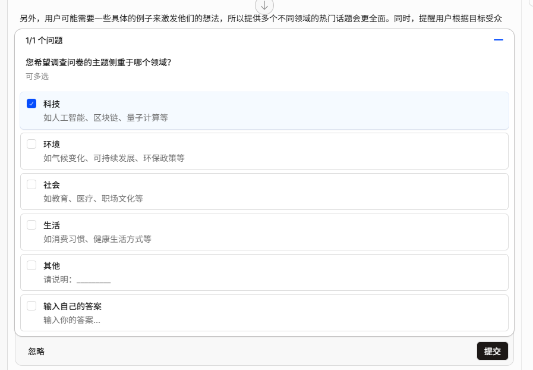

# 智能体引导式对话原理
## 效果


## 大模型处理流程
1、响应问题引导列表
```json

{
  "role": "assistant",
  "content": "<think>\nOkay, the user is trying to get recent popular topics for a survey, but the webfetch tool couldn't connect to the Google Trends URL. Let me think about why that might be.\n\nFirst, the URL they tried is \"https://trends.google.com/trends/explore?date=2023-01-01%202023-12-31&geo=US&q=AI%2C+climate+change%2C+remote+work%2C+mental+health%2C+privacy+and+data+security%2C+sustainability%2C+education+reform%2C+globalization%2C+tech+ethics\". Maybe there's a problem with the parameters. The date format might be incorrect. Google Trends typically uses a format like \"2023-01-01 2023-12-31\" for the date range, but sometimes it's better to use a shorter range or check if the API requires a different format. Also, the query parameters might be too long or have encoding issues. The commas separating the topics might need to be URL-encoded as \"%2C\" which they are, but maybe Google Trends doesn't accept multiple queries in one request. \n\nAlternatively, the user might not have internet access, or there could be a firewall blocking the connection. Since the error message says \"Unable to connect. Is the computer able to access the url?\", it's possible that the network is restricted. \n\nAnother approach: Maybe the Google Trends website is down or the specific endpoint isn't accessible. Also, using a different tool or method to fetch trending topics could help. For example, using a different service like Twitter's Trends API, Reddit's popular posts, or news aggregators. However, the user might not have access to those either. \n\nSince the webfetch tool isn't working, I should suggest alternative methods. Maybe recommend checking recent news articles or social media platforms for trending topics. Also, suggest using a different browser or network if the issue is with the current setup. If the user is in a restricted environment, they might need to use a proxy or VPN. \n\nAlternatively, provide a list of commonly trending topics based on general knowledge, such as AI advancements, climate change policies, remote work trends, mental health awareness, data privacy regulations, sustainability initiatives, education reforms, globalization challenges, and tech ethics. This way, even without the webfetch tool, the user can get some ideas. \n\nI should also check if there are any other tools available in the provided list that can help. The tools include bash, read, glob, grep, edit, write, task, and skill. None of these directly fetch web content, but maybe using the task tool with a different agent could help. However, the user might not have access to external APIs. \n\nIn conclusion, the best approach is to provide a list of recent popular topics based on general knowledge and suggest alternative methods if the webfetch tool isn't working. Also, check if the user has internet access or if there are network restrictions.\n</think>",
  "tool_calls": [
    {
      "id": "call_81618c85ad8e42bdb750aa08",
      "type": "function",
      "function": {
        "name": "question",
        "arguments": "{\"questions\":[{\"question\":\"您希望调查问卷的主题侧重于哪个领域？\",\"header\":\"领域选择\",\"options\":[{\"label\":\"科技\",\"description\":\"如人工智能、区块链、量子计算等\"},{\"label\":\"环境\",\"description\":\"如气候变化、可持续发展、环保政策等\"},{\"label\":\"社会\",\"description\":\"如教育、医疗、职场文化等\"},{\"label\":\"生活\",\"description\":\"如消费习惯、健康生活方式等\"},{\"label\":\"其他\",\"description\":\"请说明：_________\"}],\"multiple\":true}]}"
      }
    }
  ]
}
```

2、用户选择问题列表
```json
 {
  "role": "tool",
  "tool_call_id": "call_81618c85ad8e42bdb750aa08",
  "content": "User has answered your questions: \"您希望调查问卷的主题侧重于哪个领域？\"=\"科技\". You can now continue with the user's answers in mind."
}
```
3、异常处理
如果用户忽略问题、或者不处理，中断整个流程
```json
 {
  "role": "tool",
  "tool_call_id": "call_92d455aa4f684604b57918bf",
  "content": "Error: The user dismissed this question"
}

```
